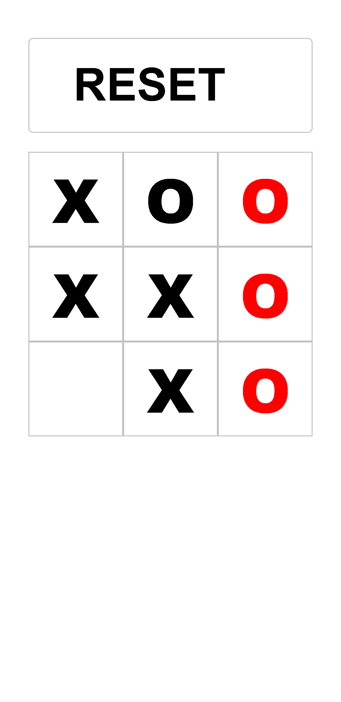

# tic-tac-toe
<p align="center">jogue um jogo da velha simples contra um bot para passar o tempo.</p>
<h4 align="center"> Status do projeto: Finalizado com possibilidade de atualização</h4>

### Tabela de conteudo

<p align="center">
<a href="#funcionalidades">funcionalidades</a> • 
<a href="#Demostração-da-Aplicação">Demostração</a> • 
<a href="#Como-executar-o-projeto">como Executar</a> • 
<a href="#Tecnologias-utilizadas">Tecnologias</a> •   
<a href="#autor">Autor</a> •
<a href="#licenc-a">Licença</a> 
</p>

### funcionalidades

- [x] Jogar contra bot
- [ ] jogar contra outro jogador real

### Demostração da Aplicação
<p>Quem nunca jogou um joguinho da velha?</p>
<p>a principal dificuldade foi desenvolver a inteligência do bot.</p>
<p><a href="https://bsantuz.github.io/Tic-tac-toe/"> TESTAR </a></p>




### Como executar o projeto
Antes de começar, você vai precisar ter instalado em sua máquina um editor para trabalhar com o código como [VSCode](https://code.visualstudio.com/)

```bash
# Clone este repositório
$ git clone <>

# Acesse a pasta do projeto no terminal/cmd
$ cd ...

# Execute a aplicação 
$ index.html ou server live(plugin do vscode)

```
            

### Tecnologias utilizadas

* Front end base(html, css, js)

### Autor
Feito com ❤️ por Bruno Santuz 👋🏽 Entre em contato!

email: brunobruno2000@hotmail.com

### Licença
MIT License
